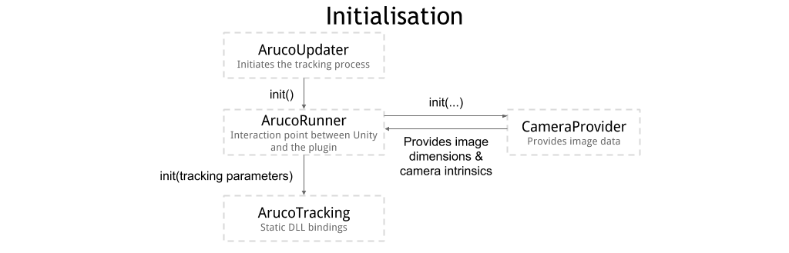
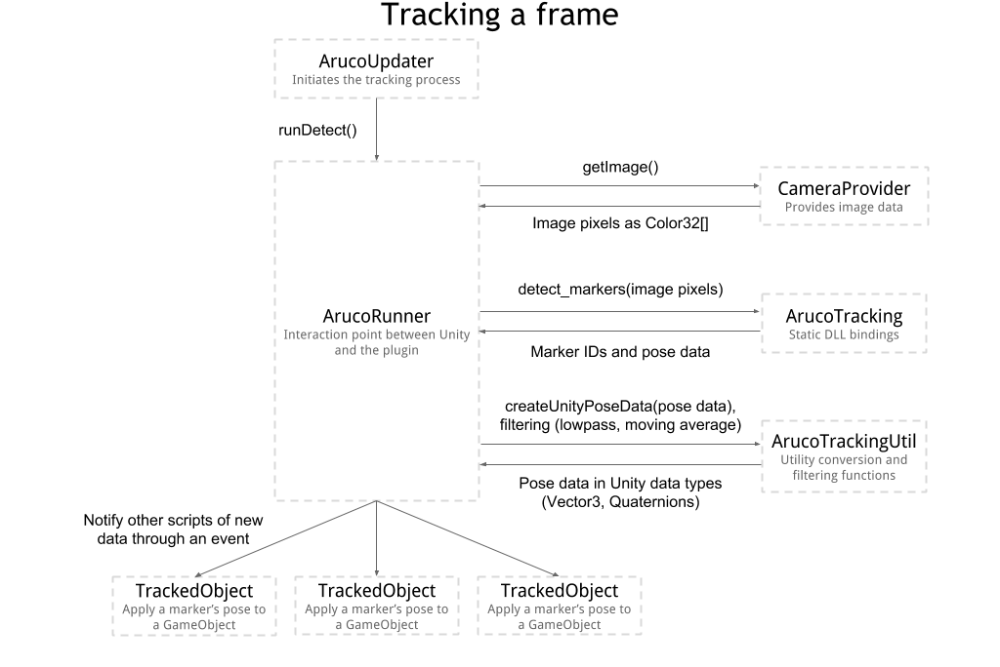

# HoloLensArucoTracking

This project is a native plugin and accompanying C# scripts for Unity that uses the OpenCV Aruco plugin to provide fiducial marker tracking on the HoloLens and in the Unity editor.

## Important Note
This project is not actively maintained, so proceed at your risk! I hope that it might still be useful in some cases, if only for learning purposes.

## Features
- Tracks Aruco fiducial markers using the OpenCV [aruco module](http://docs.opencv.org/3.1.0/d5/dae/tutorial_aruco_detection.html)
- Provides ready-for-use pose data (position & rotation) of found markers in Unity data types (Vector3, Quaternion)
- Implements some filtering methods to smooth out pose data
- Includes scripts to position GameObjects based on a given marker's pose 
- Runs in the Unity Editor and on the HoloLens
- Features a modular and easily customisable architecture

### Sections
- [Getting Started](#getting-started)
- [Finding camera intrinsics](#finding-camera-intrinsics)
- [Architecture](#architecture)
- [Script docs](#script-docs)
- [Building the plugin](#building-the-plugin)

## Getting started
To try out the plugin quickly, you can use the example Unity project in the ArucoTrackingExample folder. This includes pre-built DLLs of the plugin, as well as scenes for the Editor and the HoloLens to show a the intended setup of scripts and objects.
If you want to integrate this into your own existing project, you will have to set up the following things:
- Create a Plugins folder in your project, and copy the DLLs from the example project to that folder. (Alternatively, you can also build the plugin DLLs yourself as described below)
You should follow the same folder structure as given in the example, this will make sure that the import settings for the files are set correctly by Unity. (If you can't or don't want to follow that folder structure, make sure that the Editor DLLs are configured to be used only in Editor, and the HoloLens DLLs for the Windows Store Target, x86 architecture).
- Copy over the contents of the Scripts folder in the example to your own project. The Util folder is not strictly necessary but useful.
- Enable the WebCam capability for your Unity scene.
- In your scene, add ArucoRunner, ArucoUpdater and GeneralCameraProvider scripts to any object. (I typically use the camera, but it doesn't matter.) Drag the runner component into the public field of the Updater, and the camera provider into the field of the runner.
- If you want a specific object that is already in your scene to map to a physical marker, add a TrackedObject component to that object, and supply it with the runner and your main camera. Also give the ID number of the marker you want this object to respond to.
Alternatively, if you just want all physical markers to be represented by instances of a prefab, add a MarkerObjectPlacer component to any object, supply it with the runner, camera and the prefab you want instantiated.
- Now configure the values in the camera provider and runner. The most important values are the physical marker size in the runner (given in meters), the image resolution the script will aim to get from the camera, and the camera intrinsics in the camera provider. See below for more details on the meaning of each and how to find the camera intrinsics for your camera.
- That's it! The GeneralCameraProvider will use your webcam or, if running on the HoloLens, the HoloLens' RGB camera to track markers. See below in the detailed description of the individual components about how the system works and how you can customise and extend it for your purposes.

## Finding camera intrinsics
To find camera intrinsics, you will have to run camera calibration on images taken with the camera your app will use to find the markers. For the HoloLens, the example project includes intrinsics generated from 1408x792 photos, scaled down for 896x504 images (linearly by the ratio of the smaller image size to bigger image size). If you want to use a different image size or want to find your own intrinsics values, you should run calibration as described below.

Similarly, the Editor example project includes intrinsics for a MacBook Pro 2015 webcam, at 1280x720 resolution. Unless you have the same camera, you will certainly have to run camera calibration for the camera you do have.

To run calibration, I used the sample code provided with OpenCV under 'samples/cpp/calibration.cpp' (on github [here](https://github.com/opencv/opencv/blob/master/samples/cpp/calibration.cpp)). Print out a calibration pattern (such as [this one](http://docs.opencv.org/2.4/_downloads/pattern.png)) and take a few photos of it (around 10 is good) from various angles, then feed it into the calibration program to let it generate camera intrinsics. The values set in the GeneralCameraProvider are the focal x, focal y, center x and center y values, which are the top left, middle, top right and middle right values of the intrinsics matrix respectively. The provider also requires the 5 distortion values generated by the calibration.

For more detailed information and explanation, see [this](http://docs.opencv.org/2.4/doc/tutorials/calib3d/camera_calibration/camera_calibration.html#cameracalibrationopencv) tutorial.

## Architecture
The following two images show the typical program flow when the plugin is initialised, and when executing tracking on a single image frame. These should demonstrate how the different components are inteded to interact, and which ones you want to modify to customise the system.

## Script docs
This section gives more detailed information about the functions and fields of the core Unity scripts.

### ArucoTracking
This class binds the plugin C++ functions and exposes them on the C# side.

#### void init(int _width, int _height, float _marker_size, float[] _camera_params, int _size_reduce)
> Initialises the C++ plugin with the correct image dimensions and tracking parameters.  
> `_camera_params` should be 9 floats. The first 4 are focal x, focal y, center x, and center y of the intrinsics matrix, in that order. The remaining 5 are the 5 image distortion values.  
> `_size_reduce` is the factor by which the image is scaled down before running marker tracking. 1 means no reduction, 2 halves width and height, etc etc.

#### void detect_markers(Color32[] _image)
> Runs tracking on the given image data. The resulting data is placed in the `ids`, `corners`, `rvecs` and `tvecs` static variables, and overrides data from the previous tracking result.

---

### ArucoRunner
This is the central point that Unity scripts access to interact with the marker tracking. This handles the high-level process of tracking and provides marker pose data in an easy-to-use map for other scripts to consume.

#### CameraProvider camProvider
> Instance of a CameraProvider. This provides camera intrinsics and new frame data to the runner.

#### float markerSize
> Side length of the physical markers, in meters

#### int sizeReduce
> Factor by which the image will be scaled down before detection. 1 means no scaling, 2 halves width and height, etc. Speeds up processing, but reduces detection accuracy. A value of 2 or 4 is usually good.

#### float positionLowPass
> If a marker moves less than this distance in meters, relative to the last frame, the change in position is ignored. Useful to reduce jitter.

#### float rotationLowPass
> If a marker rotates by less than this value in degrees, relative to the last frame, the change in rotation is ignored. Useful to reduce jitter.

#### int avgFilterMemoryLength
> Number of frames that are remembered for running average filtering on marker position. The position of the marker in `poseDict` is the average of the last `avgFilterMemoryLength` positions that were detected.  
> Rotation data is always the average between the current and last frame, since averaging multiple Quaternions does not work if the difference between them is big.

#### Dictionary<int, PoseData> poseDict
> A map between the marker IDs found in the last frame that tracking was run on, and their pose data as Vector3 position and Quaternion rotation. Updated by `runDetect`

#### event Action onDetectionRun
> An event invoked every time detection was run on a new frame. Used by `TrackedObject` etc to be notified about new pose data.

#### void runDetect()
> Requests a new image from the image provider, then runs tracking over it by calling ArucoTracking.detect_markers.  
> The resulting pose data is then put into the `poseDict` Dictionary between marker IDs and pose data. An optional position offset, low-pass filtering and running-average filtering are also applied.  
> `onDetectionRun` is invoked at the end to notify all scripts that consume the new data.

---

### GeneralCameraProvider
A camera provider that uses the webcam, or a static test image. Camera intrinsics are set in the Unity Editor.

#### int webcamDeviceNumber
> Which webcam to use out of all available cameras. If there is only one, 0 should work.

#### int webcamDesiredWidth, int webcamDesiredHeight, int webcamDesiredFPS
> The image resolution and FPS the provider will request from the webcam. If the requested size cannot be provided by the webcam, the closest available values are chosen.

#### bool useTestImg, Texture2D testImg
> If `useTestImg` is set, the camera provider will use `testImg` instead of the webcam for tracking. Note that the image provided has to have read/write enabled in its import settings, and should have "nearest power of 2" scaling disabled to match the resolution required by the camera intrinsics. Useful for debugging purposes.

#### float focalX, float focalY, float centerX, float centerY
> Camera intrinsics values. They correspond to the top left, middle, top right and middle right of the camera intrinsics matrix respectively. See [Finding camera intrinsics](#finding-camera-intrinsics) for more details.

#### float[] distortion
> This should contain the 5 floats providing the distortion values generated by camera calibration. See [Finding camera intrinsics](#finding-camera-intrinsics) for more details.

---

### MarkerObjectPlacer
Places a given prefab at the position and rotation of every marker that was detected.

#### ArucoRunner trackingRunner
> The runner that the placer will subscribe to for new pose data.

#### Camera cam
> All placed objects will be parented to this camera, since the provided pose data is relative to the webcam.

#### GameObject markerObjectPrefab
> The prefab that will be intantiated for each marker.  
> The prefab should be oriented such that the direction pointing out of the marker image is along the Z+ axis.  
> The prefab will be scaled by the marker size in meter.

---

### TrackedObject
A script that applies the pose data of a given marker to the game object it is attached to.  
The object should be rotated such that the direction that should point out of the marker image aligns with the Z+ axis.

#### ArucoRunner trackingRunner
> The runner that the tracked object will subscribe to for new pose data.

#### int markerId
> The ID that this tracked object will respond to. The ID for a marker is often given alongside the image it was printed from.  
> Note that the OpenCV marker dictionary may have different marker IDs than the original Aruco dictionary, so the ID you have for a marker may not be what this plugin sees.
> Therefore, I recommend logging the IDs found in a frame through a C# script and showing your markers to the camera to get the ID they are recognised as.

#### bool persist
> Whether the object should be deactivated when the marker is not visible in the frame.

#### Camera parentCamera
> If this is provided, the object will be placed in world space based on this camera's transform (i.e. its pose is multiplied by the camera's transform).  
> Otherwise, the object is simply placed at the pose data's coordinates and rotation, in world space.

## Building the plugin
The plugin is contained in the TrackingPlugin folder as a Visual Studio project. Since the plugin uses OpenCV, you will have to install it before building:
- For the HoloLens version of the plugin, OpenCV is provided through a NuGet package already added to the project. Simply open the project, right click on the solution and select "Manage NuGet packages". On this screen it should show you the OpenCV-Hololens package already added, you will just have to install it to the project. (If for some reason this does not show up, search for the package of that name and install it to the hololens project). Once installed, OpenCV files should show up in the package folder of the solution. 
From the OpenCV-Hololens NuGet package, find the folder named 'contents', and within that 'include'. Copy this folder to the folder 'hololens' in TrackingPlugin, so that the OpenCV headers are found by the solution.
- When building for the Editor, you will have to install or build OpenCV. Since this is a HoloLens project, you are most likely on Windows, in which case the guide to installing OpenCV can be found [here](http://docs.opencv.org/2.4/doc/tutorials/introduction/windows_install/windows_install.html). If you are on another platform, you can find the guide for your platform [here](http://docs.opencv.org/master/df/d65/tutorial_table_of_content_introduction.html).
After installation, make sure that the OPENCV_DIR environment variable is correctly set to the folder containing a 'lib' and 'bin' folder with the OpenCV .lib and .dll files respectively. This variable is used by the plugin solution to find the OpenCV library files.
